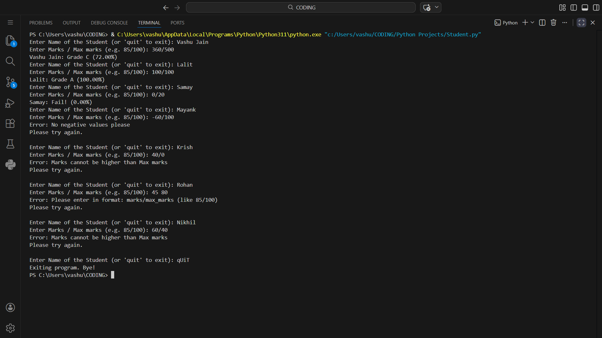

# Python Learning 2026

My journey in Python programming, automation scripts, and prep for cybersecurity career.  
All projects here are for learning + building a freelancing portfolio.

## Projects
- **Student Grading Calculator (using OOP)**  
  A simple console-based grade calculator using Python classes.  
  Features:  
  - OOP with `Student` class  
  - Percentage-based grading (A/B/C/D/Fail)  
  - Input validation & error handling (no negative marks, marks > max, etc.)  
  - Loop to add multiple students  
  - Clean f-string output with percentage  
  
  student-grading-calculator.py
## How to Run
```bash
python student-grading-calculator.py
Enter student name and marks/max_marks (e.g., 85/100). Type 'quit' to exit.

More projects coming soon (Excel automation, web scraping, basic cyber tools)!
