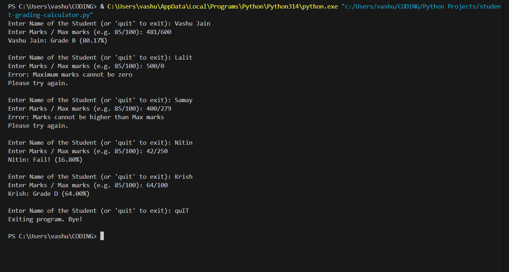

# Python Learning 2026

Hi! I'm Vashu — an 18-year-old from UP (India) learning Python for automation, freelancing, and my future in cybersecurity.  
All projects here are for skill-building + creating a real portfolio.

## Projects

- **Student Grading Calculator (using OOP)**  
  A simple console-based program to calculate and display student grades based on percentage.  

  **Features:**
  - OOP with `Student` class  
  - Percentage-based grading (A >90%, B >80%, C >70%, D >40%, Fail)  
  - Input validation & error handling (no negatives, marks ≤ max marks, no zero max marks)  
  - Interactive loop for multiple students  
  - Clean formatted output with percentage  

    
  *(Example run showing grade calculation)*

  View code: [student-grading-calculator.py](./student-grading-calculator.py)

## How to Run

1. Clone or download the repository    
2. Open a terminal / command prompt in the project folder  
3. Run:

```bash
python student-grading-calculator.py
Example usage:

Enter Name of the Student (or 'quit' to exit): Vashu
Enter Marks / Max marks (e.g. 85/100): 92/100

Example output:  
Vashu: Grade A (92.00%)
Type 'quit' as the name to exit the program.
```
More projects coming soon (Excel automation, web scraping, basic cyber tools)!
